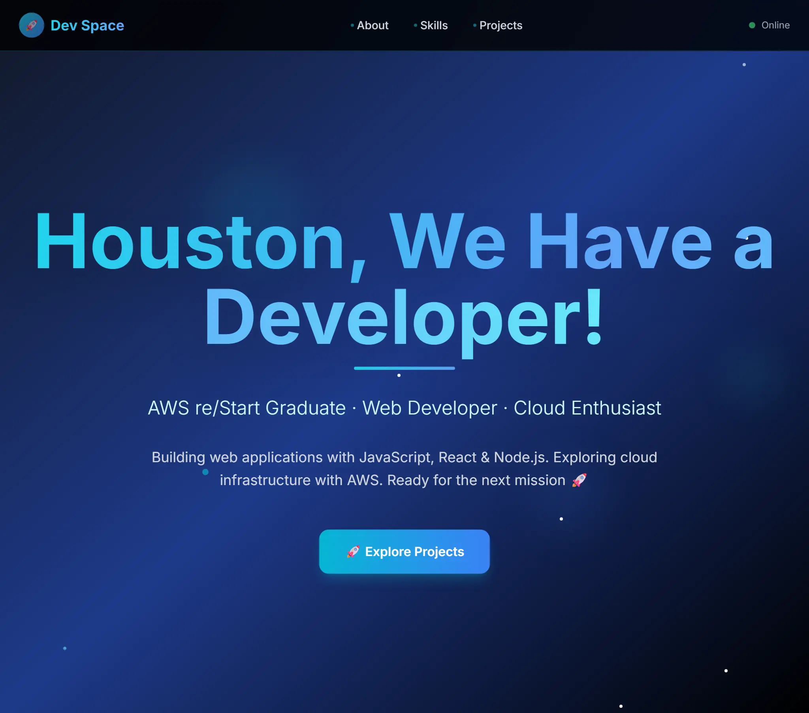

### Hi there 👋

💻 **Software developer** passionate about building cool things with code.   
☁️ AWS re/Start graduate with a foundation in **cloud technologies**.  
🤖 Exploring **AI**, **automation**, and 🐍**Python** through continuous self-learning.  
🔭 Always **curious**, always 🧠 **learning**. 

---
### 🛠️ Tech Stack

---
### 🌐 My Portfolio

---

### 🏆 Certifications

---

### 📫 Connect with me

<!--
**majskit/majskit** is a ✨ _special_ ✨ repository because its `README.md` (this file) appears on your GitHub profile.

Here are some ideas to get you started:

- 🔭 I’m currently working on ...
- 🌱 I’m currently learning ...
- 👯 I’m looking to collaborate on ...
- 🤔 I’m looking for help with ...
- 💬 Ask me about ...
- 📫 How to reach me: ...
- 😄 Pronouns: ...
- ⚡ Fun fact: ...
-->
